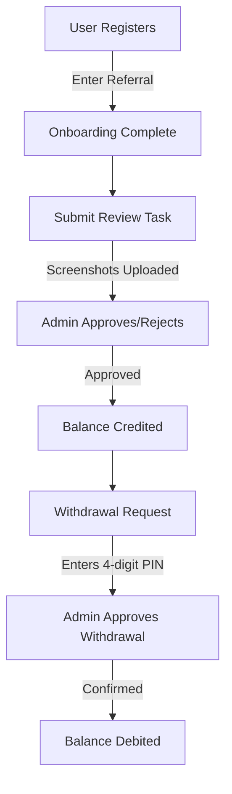

# Amazon Vine Evaluation & Admin Control Panel

A full-stack administrative control system and user dashboard designed for managing and tracking Amazon Vine reviews, user balances, deposits, withdrawals, and support chats.

---

## 🛠️ Tech Stack

### Frontend
* **Core:** React 19, TypeScript
* **Build Tool:** Vite 6
* **Styling:** Tailwind CSS v4
* **Icons:** Lucide React
* **Animations:** Motion (formerly Framer Motion)

### Backend
* **Core:** Node.js, Express, TypeScript
* **Runtime Runner:** tsx (TypeScript execute)
* **Real-time:** WebSockets (`ws` package)
* **Security:** Helmet (Content Security Policy), Express Rate Limit, CORS

### Database
* **Engine:** PostgreSQL hosted on Supabase
* **Client:** `@supabase/supabase-js`

---

## 📦 Directory Structure

```text
amazon-panel/
├── backend/
│   ├── database/
│   │   └── schema.sql        # Consolidated master database schema
│   ├── public/
│   │   ├── admin/            # Pre-built admin panel static assets
│   │   ├── uploads/          # Local static files upload directory
│   │   └── super.html        # Super admin panel interface
│   ├── src/
│   │   ├── config/           # Database & Store configurations
│   │   ├── middlewares/      # Express authentication & rate-limiting middleware
│   │   ├── routes/           # REST API endpoints (Auth, Admin, Chat, Reviews, Transactions)
│   │   ├── services/         # WebSockets, Audit logging, Caching
│   │   └── server.ts         # Backend entry point
│   ├── package.json
│   └── tsconfig.json
├── frontend/
│   ├── src/
│   │   ├── pages/            # React pages (Landing, Login, Dashboard, etc.)
│   │   ├── main.tsx          # Frontend entry point
│   │   └── index.css         # Global Tailwind directives
│   ├── package.json
│   └── vite.config.ts
├── README.md                 # Project summary and documentation
└── deployment.md             # Direct instructions for going live
```

---

## 🌟 Core App Features

1. **User Portal:**
   - Onboarding with referral codes.
   - Task view for submitting review screenshots.
   - Wallet manager to request deposits and withdrawals.
   - Live support chat with administrators.

2. **Admin Control Panel (`/admin`):**
   - Live stats dashboard (Growth charts, deposit/withdrawal flow, activity feed).
   - User database management with status editing.
   - Review submission verification (Approve/Reject review requests).
   - Deposit and Withdrawal request verification.
   - Support Chat portal matching admins with users.

3. **Super Admin Control Panel (`/super-admin`):**
   - Admin account management (Create/restrict administrative users).
   - Assigned User Matrix (Bind specific administrators to manage select users).
   - Audit trail tracker (Log IP, timestamp, and details of administrative activities).

---

## 🔄 Core Workflows



### 1. Verification & Wallet Flow
1. **Submit Reviews:** Users upload screenshots to claim rewards. Submissions enter a **Pending** queue.
2. **Review Approval:** Administrators inspect the screenshots from the Admin dashboard and approve/reject. Approvals add rewards directly to the user's ledger.
3. **Withdrawal Requests:** Users request a withdrawal by entering their exact **4-digit withdrawal PIN**.
4. **Approval & Payout:** Admins verify the withdrawal request, deduct the amount, and process the payout.

### 2. Live Support Chat Workflow
1. A user sends a message via the support chat widget.
2. The WebSocket server receives the message and broadcasts a real-time event to all active admins.
3. Any active admin can reply instantly, which sends the message back to the specific user session in real time.

### 3. Super Admin & Assigned Users Matrix
1. **Create Admins:** Super Admins create individual admin accounts.
2. **Restricted Mode:** Admins can be marked as `is_restricted`.
3. **Scope Binding:** Restricted admins can *only* view stats and manage users who have been explicitly assigned to them in the `admin_assigned_users` table.

---

## 🚀 Running Locally

### 1. Database Setup
1. Create a PostgreSQL Database on [Supabase](https://supabase.com/).
2. Run the queries inside `backend/database/schema.sql` in the **SQL Editor** on your Supabase dashboard to create the tables.

### 2. Run Backend
1. Go into the backend directory:
   ```bash
   cd backend
   ```
2. Create a `.env` file and populate it (see `backend/.env.example`).
3. Install dependencies:
   ```bash
   npm install
   ```
4. Start the development server:
   ```bash
   npm run dev
   ```

### 3. Run Frontend
1. Go into the frontend directory:
   ```bash
   cd ../frontend
   ```
2. Install dependencies:
   ```bash
   npm install
   ```
3. Start the development server:
   ```bash
   npm run dev
   ```
4. Access the web app at `http://localhost:3000`.
